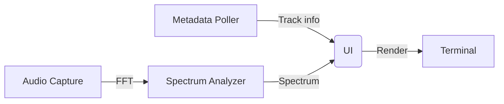

# feat: Add Windows music visualizer with audio capture and track info display

## Summary
Create a terminal-based music visualizer for Windows that displays currently playing track information and an audio-reactive visualization resembling CLIAMP, using Go with charm bracelet for UI and capturing system audio for real-time spectrum analysis.

## Problem Frame
Users want to visualize music currently playing on their Windows system in a terminal environment, with track info and an animated visualizer that responds to the audio. Existing solutions may be GUI-only or lack integration with Windows NowPlaying.

## Requirements
- Retrieve track metadata (title, artist, album) via Windows NowPlaying APIs.
- Capture system audio to compute real-time frequency spectrum.
- Render animated visualization in terminal using charm bracelet.
- Display track info alongside visualization.
- Update display in real-time as track changes and audio plays.
- Resemble CLIAMP visualizer style (assumed vertical bar spectrum).

## Key Technical Decisions
- **Language/UI Framework**: Go with charm bracelet for terminal UI (chosen for lightweight, terminal-native experience).
- **Audio Capture**: Use Windows WASAPI or PortAudio via Go bindings (e.g., github.com/gordonklaus/portaudio) to capture system audio and compute FFT for spectrum.
- **NowPlaying Access**: Utilize Go Windows syscall packages (golang.org/x/sys/windows) to query COM-based NowPlaying interfaces.
- **Visualization Style**: Vertical bar spectrum (common CLIAMP style) updating based on audio frequency bands.
- **Concurrency**: Separate goroutines for audio capture, metadata polling, and UI rendering to avoid blocking.

## High-Level Technical Design

The visualizer consists of four main components: metadata poller, audio capture engine, spectrum analyzer, and terminal UI. Data flows as follows:
1. Metadata poller queries Windows NowPlaying every 500ms and sends updates via channel.
2. Audio capture engine reads loopback audio via PortAudio, computes FFT, and outputs frequency band amplitudes.
3. Spectrum analyzer (part of audio engine) updates shared spectrum struct with mutex.
4. UI component (charm bracelet bubbletea) renders metadata and spectrum bars at 60fps.

Sequencing: Metadata and audio run independently; UI updates on latest data from both. No strict ordering; concurrent updates merged in UI.

State machine: Playback state (playing/paused/stopped) from metadata affects UI (e.g., show paused icon).

Component diagram (mermaid):


## Implementation Units
### U1. Project Setup and Dependencies
**Goal**: Initialize Go module and add required dependencies (charm bracelet, audio capture lib, Windows syscall).
**Requirements**: 
- R1: Enable Go module management.
- R2: Add charm bracelet (github.com/charmbracelet/bubbletea/v2 and lipgloss/v2).
- R3: Add audio capture library (e.g., github.com/gordonklaus/portaudio).
- R4: Add Windows syscall (golang.org/x/sys/windows).
**Dependencies**: None.
**Files**: 
- go.mod
- go.sum
**Approach**: 
- Create go.mod with module name.
- Get dependencies via go get.
- Verify imports compile.
**Execution note**: Start with a failing test for dependency resolution.
**Technical design**: 
```
module termvu/musicviz

require (
    github.com/charmbracelet/bubbletea/v2 v0.22.0
    github.com/charmbracelet/lipgloss/v2 v0.8.0
    github.com/gordonklaus/portaudio v0.0.0-20231204151908-66e1c201b5f6
    golang.org/x/sys/windows v0.15.0
)
```
**Patterns to follow**: Standard Go module layout.
**Test scenarios**: 
- `go mod tidy` succeeds.
- All imports build without error.
**Verification**: `go build ./...` passes.

### U2. NowPlaying Metadata Retrieval
**Goal**: Query Windows NowPlaying for current track metadata (title, artist, album, playback state).
**Requirements**: 
- R1: Get track title, artist, album.
- R2: Detect playback state (playing/paused/stopped).
- R3: Handle metadata changes.
**Dependencies**: U1.
**Files**: 
- src/metadata.go
- src/metadata_test.go
**Approach**: 
- Use IMusicProperties interface via Windows COM.
- Poll metadata every second (or use event if available).
- Cache last metadata to detect changes.
**Execution note**: Implement with mocking for unit tests.
**Technical design**: 
```go
type Metadata struct {
    Title  string
    Artist string
    Album  string
    Playing bool
}

func GetMetadata() (Metadata, error) {
    // TODO: Implement via IMusicProperties
}
```
**Patterns to follow**: Existing Go Windows API patterns (e.g., from github.com/Microsoft/go-winio).
**Test scenarios**: 
- Mock COM to return fixed metadata.
- Simulate metadata change.
- Handle errors when no player active.
**Verification**: Unit tests pass; manual test with music player shows correct metadata.

### U3. System Audio Capture and Spectrum Analysis
**Goal**: Capture system audio output, compute FFT, and output frequency band amplitudes.
**Requirements**: 
- R1: Capture audio from default output device (loopback).
- R2: Compute FFT on audio buffers.
- R3: Output amplitude for N frequency bands (e.g., 30 bands).
- R4: Provide thread-safe access to latest spectrum.
**Dependencies**: U1.
**Files**: 
- src/audio.go
- src/audio_test.go
**Approach**: 
- Use PortAudio to open loopback stream.
- Callback processes audio frames, applies window function, runs FFT.
- Extract magnitudes for frequency bands.
- Update shared spectrum struct with mutex.
**Execution note**: Begin with sine wave test to verify FFT.
**Technical design**: 
```go
type Spectrum [30]float64 // amplitudes for 30 bands

var (
    spectrum Spectrum
    spectrumMu sync.Mutex
)

func audioCallback(in []int32) {
    // convert to float32, window, FFT, band energies
    // update spectrum with lock
}
```
**Patterns to follow**: PortAudio Go examples; standard FFT implementation (e.g., github.com/mjibson/go-dsp/fft).
**Test scenarios**: 
- Inject sine wave, verify peak in correct band.
- Silence yields near-zero amplitudes.
- Volume scaling affects amplitudes linearly.
**Verification**: Unit tests pass; manual test with music shows changing spectrum.

### U4. Terminal UI with Charm Bracelet
**Goal**: Build charm bracelet UI showing visualization bars and track info panel.
**Requirements**: 
- R1: Display vertical bar spectrum (30 bars) in color.
- R2: Show track title, artist, album in header.
- R3: Indicate playback state (play/paused).
- R4: Handle terminal resize.
**Dependencies**: U1, U2.
**Files**: 
- src/ui.go
- src/ui_test.go
**Approach**: 
- Use bubbletea.Model for UI.
- View renders spectrum as bar chart and metadata as text.
- Update model via messages from metadata and audio goroutines.
**Execution note**: Start with static UI, then add updates.
**Technical design**: 
```go
type model struct {
    metadata Metadata
    spectrum Spectrum
    width    int
    height   int
}

func (m model) View() string {
    // render header with metadata
    // render bar spectrum using lipgloss
}
```
**Patterns to follow**: charm bracelet bubbletea tutorials.
**Test scenarios**: 
- UI renders without panic.
- Bar heights spectrum values.
- Header shows correct metadata.
**Verification**: UI renders correctly in terminal; resizing adjusts layout.

### U5. Real-Time Integration
**Goal**: Connect metadata polling, audio capture, and UI updates for live display.
**Requirements**: 
- R1: UI updates when metadata changes.
- R2: UI updates at least 30fps from audio spectrum.
- R3: Graceful shutdown on Ctrl+C.
**Dependencies**: U1, U2, U3, U4.
**Files**: 
- src/main.go
**Approach**: 
- Launch metadata polling goroutine (every 500ms).
- Launch audio capture goroutine (PortAudio callback).
- bubbletea program runs UI, updating model on messages.
- Use channels to send metadata and spectrum updates.
**Execution note**: Test with actual music player.
**Technical design**: 
```go
func main() {
    // setup metadata channel
    // setup spectrum channel
    // start metadata poller
    // start audio capture
    p := tea.NewProgram(initialModel())
    go func() {
        for {
            select {
            case m := <-metadataChan:
                p.Send(MetadataMsg{m})
            case s := <-spectrumChan:
                p.Send(SpectrumMsg{s})
            }
        }
    }()
    if err := p.Start(); err != nil {
        log.Fatal(err)
    }
}
```
**Patterns to follow**: bubbletea async command patterns.
**Test scenarios**: 
- Metadata change updates header.
- Spectrum change updates bars.
- Program exits cleanly.
**Verification**: Manual test with music player shows synchronized viz and track info.

### U6. Visualization Polish to Match CLIAMP
**Goal**: Refine visualization to resemble CLIAMP (assumed vertical bar spectrum with specific styling: bar colors, spacing, fade effect).
**Requirements**: 
- R1: Adjust bar colors (e.g., green to red gradient).
- R2: Add spacing between bars.
- R3: Implement peak hold or decay effect.
- R4: Ensure smooth animation at 60fps.
**Dependencies**: U4, U5.
**Files**: 
- src/ui.go (update View method)
**Approach**: 
- Modify bar rendering: color based on amplitude, add gap.
- Add decay by reducing amplitude slowly over frames.
- Tune frame rate via ticker.
**Execution note**: Iterate with visual feedback.
**Technical design**: 
```go
// in View:
for i, amp := range m.spectrum {
    color := lipgloss.AdaptiveColor{Light: "#"+hexGradient(i), Dark: "#"+hexGradient(i)}
    bar := lipgloss.NewStyle().
        Background(color).
        Width(2).
        Height(int(amp * maxHeight)).
        MarginRight(1)
    // render bar
}
```
**Patterns to follow**: Existing terminal visualizers (e.g., gotop, bpytop).
**Test scenarios**: 
- Visual appearance matches reference (if available).
- Decay effect visible.
- No flickering at target FPS.
**Verification**: Manual inspection; user feedback on resemblance.

## Dependencies
- Go 1.22+
- Windows 10+ (for NowPlaying and audio capture)
- PortAudio installed (for audio capture library)

## Open Questions
- Exact appearance of CLIAMP visualizer: need reference to confirm bar style, colors, animation.
- Permissions for audio capture: may need to run as admin or enable loopback in Windows settings.
- Metadata polling interval: balance freshness vs CPU usage.

## Acceptance Examples
- When music plays in any Windows app (Spotify, Winamp, etc.), visualizer shows track title/artist and animated bars reacting to music.
- When paused, visualization freezes or shows idle state.
- When stopped, visualization clears or shows stopped state.

## System-Wide Impact
- Minimal: runs as user-mode terminal app, no system modifications.
- Audio capture may require microphone access permissions in Windows privacy settings.

## Sources & Research
- Go Windows syscall: golang.org/x/sys/windows
- PortAudio Go: github.com/gordonklaus/portaudio
- charm bracelet: github.com/charmbracelet/bubbletea
- FFT implementation: github.com/mjibson/go-dsp/fft
- NowPlaying via COM: Microsoft documentation on IMusicProperties
```